# Concrete Hand Bag

The **Concrete Hand Bag** website is a static HTML and CSS project designed to serve as the official site for the fictional band *Concrete Hand Bag*. This website aims to be an engaging and informative resource for fans, new visitors, and potential event organizers interested in the band’s music, background, and booking information.

Its purpose is to showcase the band's identity, provide access to multimedia content such as band photos and videos, and offer a way to contact the band directly. The site is built using semantic HTML5 and custom CSS3, with an emphasis on accessibility, responsiveness, and clear visual hierarchy.

Whether users are loyal fans or curious newcomers, this website is designed to be intuitive and accessible across all devices.

### User Stories

-As a fan, I want to view information about the band, so I can learn about their background and members.

-As a visitor, I want to listen to music and watch videos, so I can enjoy the band's content.

-As a supporter, I want to purchase merchandise, so I can support the band financially.

-As an event organizer, I want to contact the band via a form, so I can book them for events.

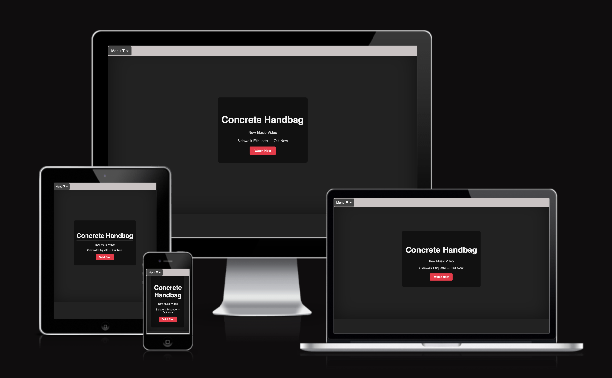

**Live Website:  https://brianjdowling101.github.io/project-1-concrete-handbag/** 

---
### Design Choices

- Color Scheme: High-contrast colors with white highlighted text for readability.

- Typography: Readable fonts with clear hierarchy for headings and body text.

- Layout: Grid-based layouts for band members and tour dates; fixed navigation bar for easy access.

- Accessibility: Focused on WCAG standards, including text contrast, readable fonts, and form labels.
---  
### Wireframes Summary

- Wireframes guided the site’s structure and functionality:

- Banner: Band rooftop image, note board for new track, link to Music & Media section.

- Navigation: Fixed top bar with smooth-scrolling links to Home, About, Music & Media, Tour Dates, and Contact.

- About the Band: Bio, formation story, musical influences, band members grid.

- Music & Media: Embedded YouTube video, external music links.

- Tour Dates: Table of upcoming shows (USA & Europe).

- Support the Band: Patreon and Etsy links for merchandise.

- Booking / Contact Form: Name, Email, Message fields, submit button, thank-you message.

- Footer: Social media links and copyright notice.

## Features

### The Banner  
The website features a bold and creative header that reflects the band’s unique and edgy style. The header includes:
- Image of the band posing on a rooftop of a builing.
- Note board with information about their new track called Side Walk Etiquette.
- A link to their new track, which bring the users to The Music and Media section of the website.

---

### Navigation Bar  
The navigation bar is fixed to the top of the page and includes smooth-scrolling links (or page links) to the following key sections:
- Home
- About the Band
- Music & Media
- Tour Dates
- Contact

Each section is easy to locate and accessible, with hover effects for improved user feedback.

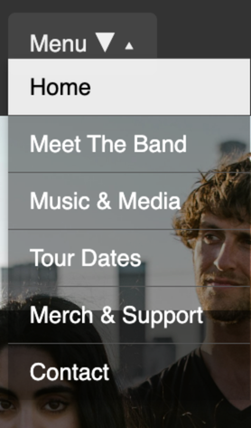
---

### About the Band  
This section provides background information about **Concrete Hand Bag**, including:
- A short bio
- Details on how the band was formed
- Musical influences
- Band members/band photos

## Meet the Members  
A grid layout introduces the individual band members, including:
- Names
- Role in the band
- Fun facts or mini-bios
- Individual photos

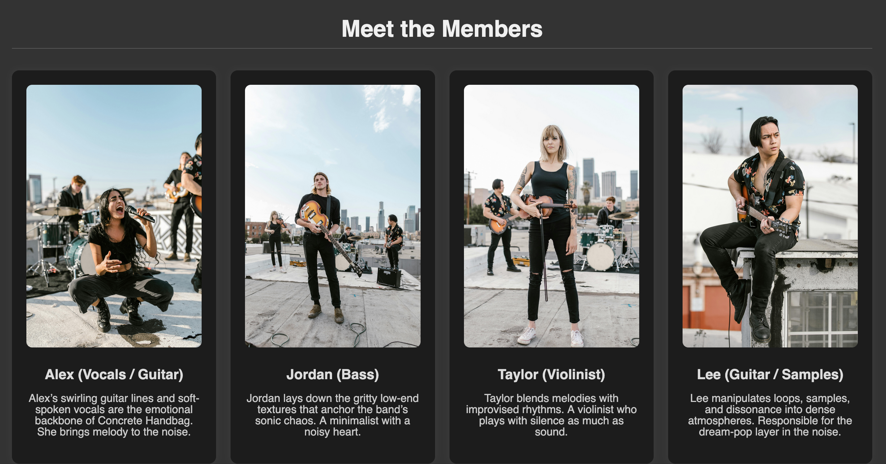
---

### Music & Media  
This section features:
- Embedded YouTube video.
- Links to external platforms such as Apple Music.

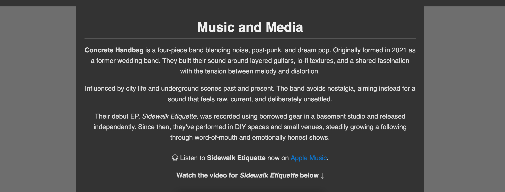

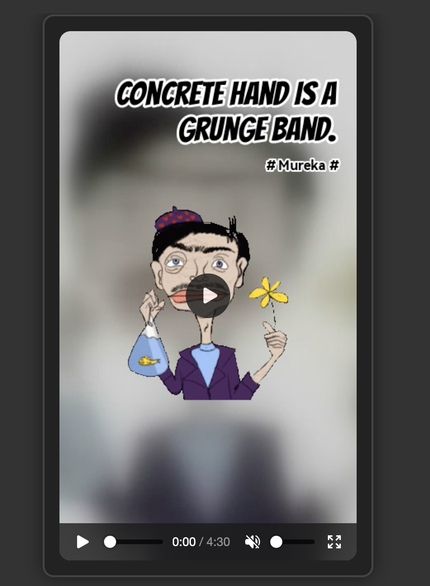

The **highlighted words** have been changed to **white** to improve **readability** and **accessibility** for all readers.

---

### Tour Dates  
A two table displays upcoming tour dates with:
- Dates
- Location (USA & Euro)
- Venue names

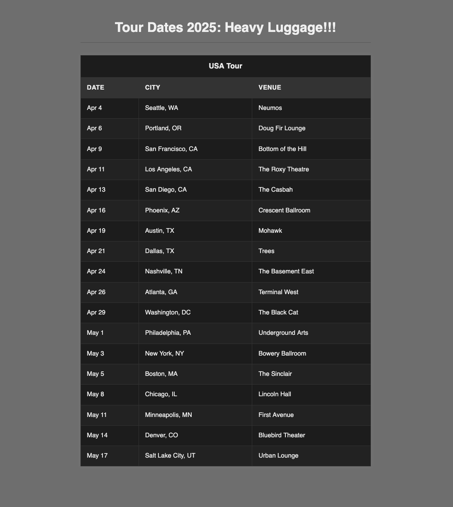

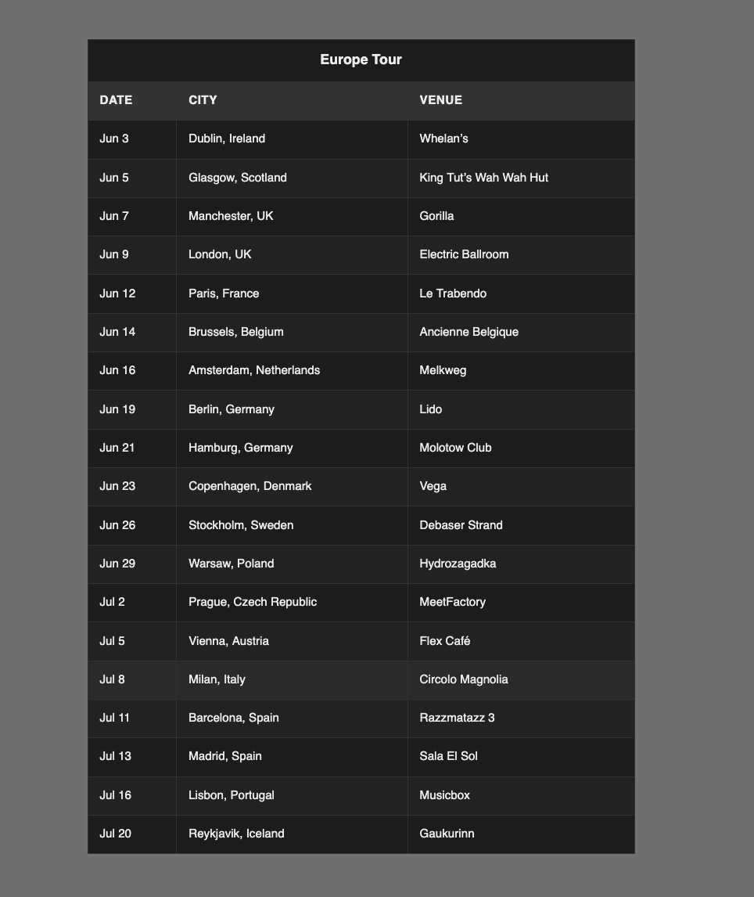

---
### Support The Band.

This section has links to the Band's:

 - Patreon
 - Etsy

 To encourage the fans to support the band by purchasing merchandise, such as shirts, posters, or music. This helps generate revenue while strengthening fan loyalty.

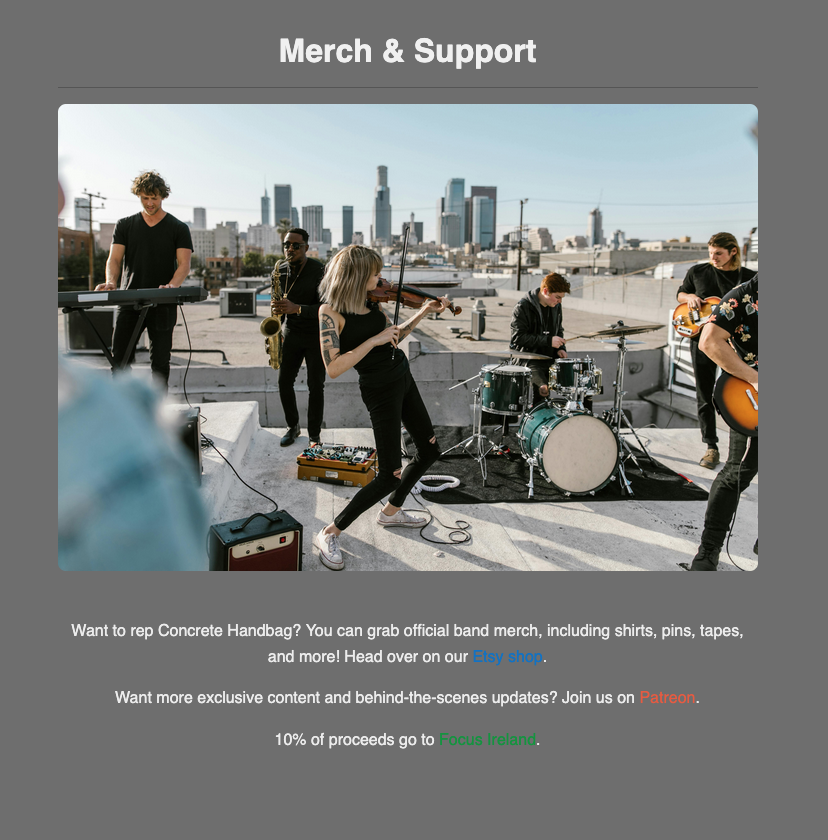

The **highlighted links** have been changed to **white** to improve **readability** and **accessibility** for all readers.

---

### Booking / Contact Form  
Users can reach out via a styled contact form that includes:
- Name field
- Email field
- Message field
- Submit

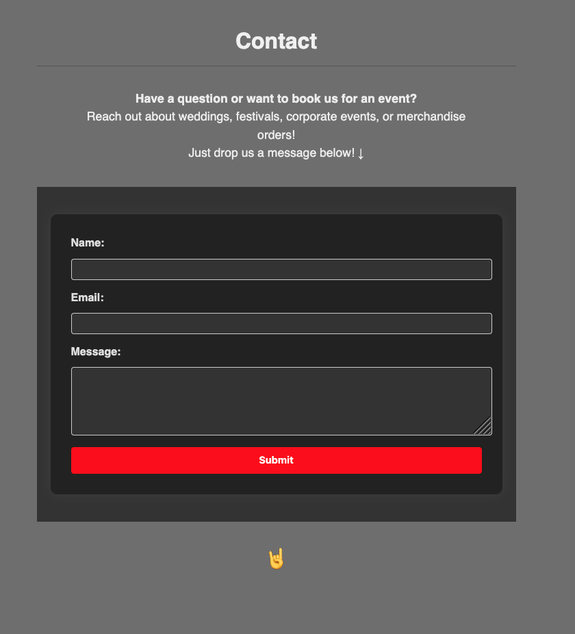

- Will recieve a Thank You Message! Encourages fans to stay connected, increasing loyalty and interaction.

---

### Footer  
The footer contains:
- Social media links (Instagram, X, Facebook and spotify)
- Copyright symbol

These provide fans with easy access to the band’s online presence. Social media keeps fans engaged, helps the band grow its audience, and allows direct communication about releases, tours, or news. Spotify links let fans listen to music immediately, boosting streams and visibility. Copyright Symbol, Legally indicates ownership of the content (music, images, text, website). It protects the band’s intellectual property and signals professionalism.

---

### Future Features

- Interactive music player on-site.

- Dynamic tour calendar with ticket purchase links.

- Newsletter subscription for fans.

- Dark/light mode toggle for improved accessibility.

- Enhanced animations and transitions for multimedia sections.

---

## Testing

### HTML & CSS Validation 

- **W3C HTML Validator:** All pages now pass validation.  
Previously, two stray code errors were detected and have since been corrected. The site now validates with **zero errors**. 

[W3C HTML Validator](https://validator.w3.org/):

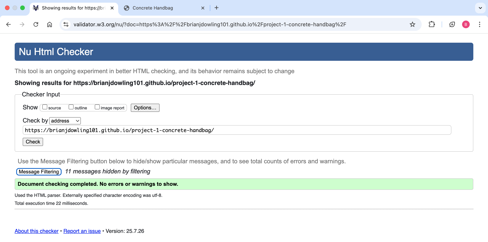

- **W3C CSS Validator** All pages now pass validation.  
No errors or warnings were found. The CSS fully conforms to W3C standards.
[W3C CSS Validator](https://jigsaw.w3.org/css-validator/):

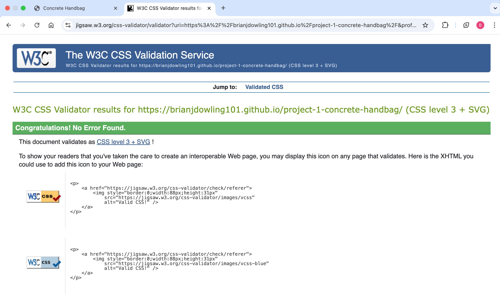

### Accessibility Testing  
Designed for accessibility, it includes high-contrast colour schemes and readable fonts.

- ✅ Lighthouse accessibility audit:

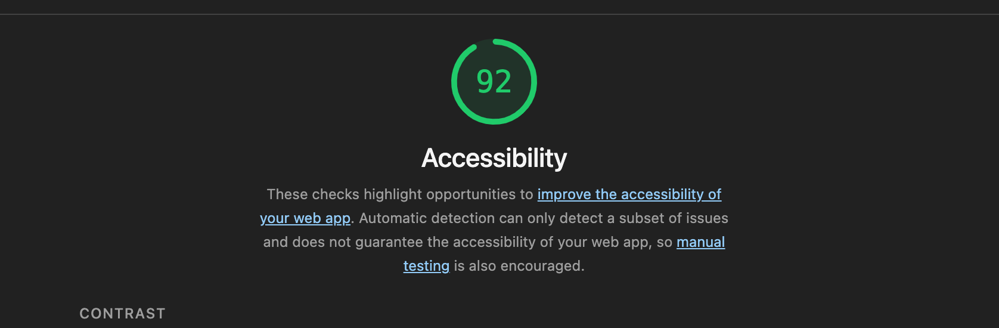

### Accessibility Improvements

Previously, the website had 11 contrast-related accessibility errors identified by the WAVE accessibility checker. These issues affected text readability, particularly in the dropdown menu and the merch/support sections. 

All 11 contrast issues have now been fully resolved. Text visibility and contrast have been improved across all areas to meet accessibility standards and ensure a better experience for all users.

### Browser Compatibility  
Tested successfully in:
- Google Chrome
- Mozilla Firefox
- Microsoft Edge
- Safari

### Responsive Testing  
Checked across: (To do lisit!)

- Desktop

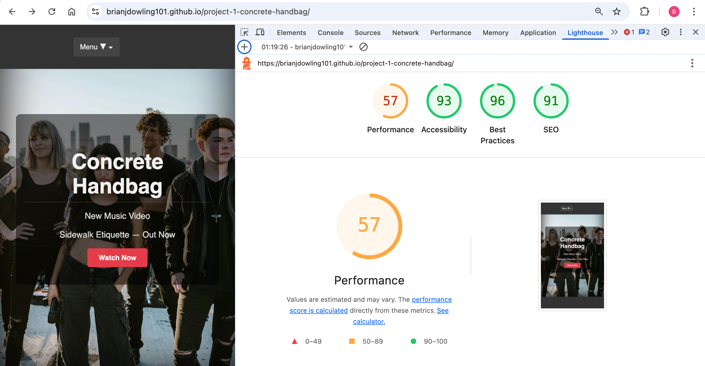

- Mobile/Tablet

- Overall, the coding has been going well, but there’s been a bit of a drop in consistency lately. One thing to watch out for the future is image sizing (Example: Banner Image), but it makes a big difference in how things look and work. Keeping an eye on that and moving forward will help keep everything running smoothly and looking sharp!
---

## Deployment

The site was deployed using GitHub Pages via these steps:
1. Project pushed to GitHub repository
2. In GitHub, navigated to **Settings** > **Pages**
3. Deployed using the `main` branch and `/root`
4. Website is accessible at:  

Add link here: https://brianjdowling101.github.io/project-1-concrete-handbag/** 

---

## Attribution

### Code
- Navigation bar structure inspired by Code Institute’s **Love Running** project and The **Trinity College** Project on my Github.

- CSS transitions and form validation ideas sourced from [W3Schools](https://www.w3schools.com/) and [MDN Web Docs](https://developer.mozilla.org/).

Code snippets from external tutorials are clearly commented and attributed in the HTML/CSS files.

### Content
- All text written by the developer.
- Band name is fictional and for educational use only.
- Band images come from Pexel.
- The Video is also fictional piece of work.

### Media
- Images and videos sourced from **Pexels** and **Unsplash** under free commercial licenses.

- Screenshots were taken from my work on the project using Visual Studio and some were captured via Google Developer Tools.

---

## Debugging
- The project has been successfully set up and verified. Debugging workflows using Firefox Developer Tools and Visual Studio have been tested, and the application runs as intended without errors. All core functionalities are operational, and the environment is stable, making it ready for further development or deployment.

---

## Credits

This project was created as part of a front-end development module focused on HTML5 and CSS3 fundamentals. It is intended to demonstrate competence in static website creation, layout, design, and content structure.

---